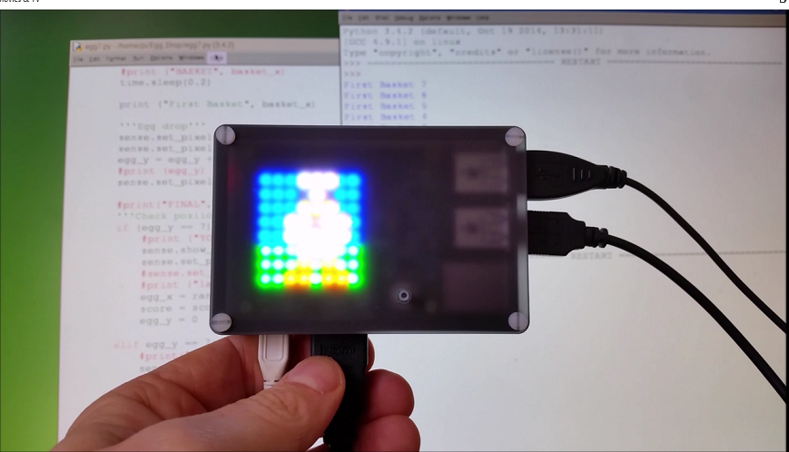

# Egg-Drop
Sense HAT Egg Drop Game

Video here: https://youtu.be/QmjHMzuWIqI

Egg Drop is a simple game where eggs fall from the top of the Sense HAT.  The egg falls toward the ground under the influence of gravity!  You have a basket which you can use to catch the eggs.  If you catch one, then you gain one point and your score goes up.  Welcome to round two.  A new egg now drops from a random position at the top of the Sense HAT.  To control your basket, tilt your SenseHat left or right which will measure the change in the axis and move the basket.

However, if you miss the egg then the it’s ‘Game Over’ and you have to start again.

